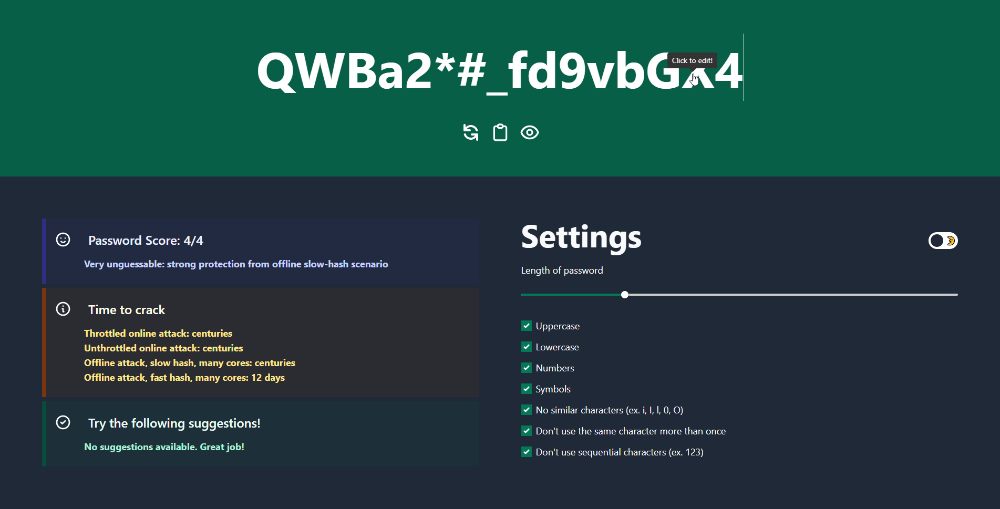

# Enigma

A minimalistic web utility to assist with creating secure passwords.



## Live Demo

<https://martin226.github.io/enigma/>

## Project setup

```
yarn install
```

### Compiles and hot-reloads for development

```
yarn serve
```

### Compiles and minifies for production

```
yarn build
```

### Lints and fixes files

```
yarn lint
```

### Customize configuration

See [Configuration Reference](https://cli.vuejs.org/config/).
